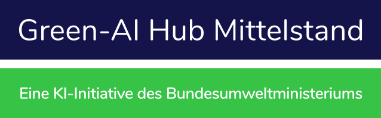

<a name="readme-top"></a>


<br />
<div align="center">
  <h1 align="center">SUSPEKT Demonstrator</h1>
  
  <p align="center">
    <a href="https://github.com/Green-AI-Hub-Mittelstand/readme_template/issues">Report Bug</a>
    ·
    <a href="https://github.com/Green-AI-Hub-Mittelstand/readme_template/issues">Request Feature</a>
  </p>

  <br />

  <p align="center">
    <a href="https://www.green-ai-hub.de">
    
  </a>
    <br />
    <h3 align="center"><strong>Green-AI Hub Mittelstand</strong></h3>
    <a href="https://www.green-ai-hub.de"><u>Homepage</u></a> 
    | 
    <a href="https://www.green-ai-hub.de/kontakt"><u>Contact</u></a>
  
   
  </p>
</div>

<br/>

## About The Project

The SUSPEKT Demonstrator is a three-camera inspection and labeling setup for System180 components.
It combines one center USB webcam and two side-mounted OAK-1 Max cameras to detect components,
measure them, and show live camera views in a browser-based user interface. The normal demonstrator
mode supports component capture, label preview, direct printing to a connected Niimbot label printer,
ROI calibration for the center camera, and persistent left/right assignment of the side cameras.

<p align="right">(<a href="#readme-top">back to top</a>)</p>

## Table of Contents

<p align="right">(<a href="#readme-top">back to top</a>)</p>


## Getting Started

Clone this repository and navigate into it with your terminal.

### Installation

Install the project into your user environment:

```sh
python3 -m pip install -e . --user
```

### Update

To update the local installation, pull the latest changes and install again:

```sh
git pull
python3 -m pip install -e . --user
```

<p align="right">(<a href="#readme-top">back to top</a>)</p>


## Usage

Open the demonstrator UI in your browser after starting the application locally. Use the live center
camera view to capture a component, select the detected result in the dropdown, review the generated
label preview, and print it if a Niimbot printer is connected. The settings area in the top-right
corner provides access to ROI calibration and persistent side-camera assignment.


## Contributing

Contributions are what make the open source community such an amazing place to learn, inspire, and create. Any contributions you make are **greatly appreciated**.

If you have a suggestion that would make this better, please fork the repo and create a pull request. You can also simply open an issue with the tag "enhancement".
Don't forget to give the project a star! Thanks again!

1. Fork the Project
2. Create your Feature Branch (`git checkout -b feature/AmazingFeature`)
3. Commit your Changes (`git commit -m 'Add some AmazingFeature'`)
4. Push to the Branch (`git push origin feature/AmazingFeature`)
5. Open a Pull Request

<p align="right">(<a href="#readme-top">back to top</a>)</p>


## License

Distributed under the MIT License. See `LICENSE.txt` for more information.

<p align="right">(<a href="#readme-top">back to top</a>)</p>


## Contact

Green-AI Hub Mittelstand - info@green-ai-hub.de

Project Link: https://github.com/Green-AI-Hub-Mittelstand/repository_name

<br />
  <a href="https://www.green-ai-hub.de/kontakt"><strong>Get in touch »</strong></a>
<br />
<br />

<p align="left">
    <a href="https://www.green-ai-hub.de">
    
  </a>

<p align="right">(<a href="#readme-top">back to top</a>)</p>
