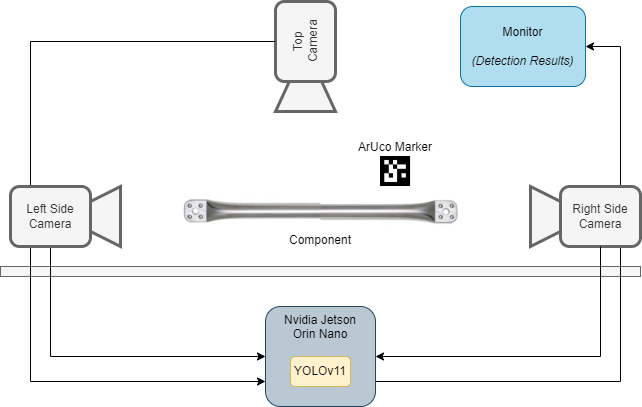
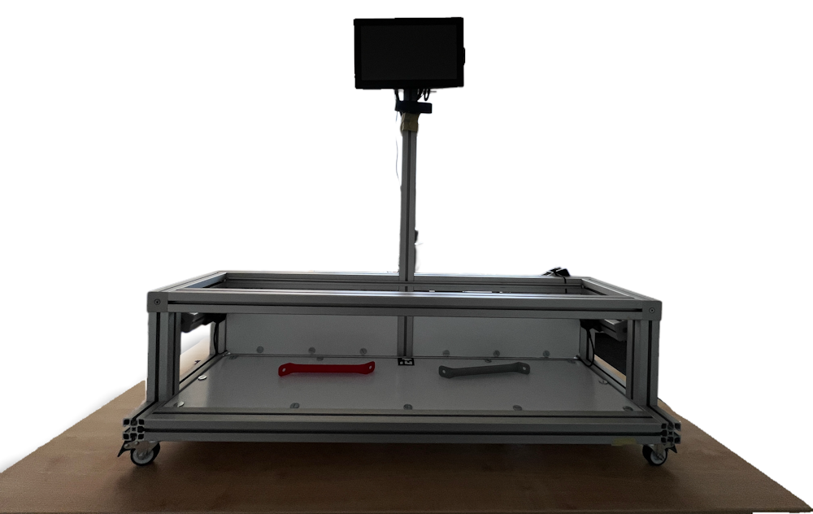

# Hardware

The demonstrator is a self-contained edge system built around a Jetson, three cameras, a monitor, and a Bluetooth label printer.

## Demonstrator overview

The setup consists of:

- one NVIDIA Jetson Orin Nano as the compute device
- two Luxonis OAK-1 Max cameras mounted on the left and right side
- one OBSBOT Meet 2 camera mounted in the center/top position
- one monitor for the live UI and detection output
- one NIIMBOT B1 series smart label printer connected over Bluetooth for QR-code label printing
    - Label size: 50x30

The left and right cameras observe the component from the sides. The center camera observes the component from above/front and provides the main detection view. The label printer is used after detection to print QR-code labels for the detected components.

## Jetson host

The currently connected host is:

- Model: `NVIDIA Jetson Orin Nano Engineering Reference Developer Kit Super`
- Installed JetPack package line: `6.2.1`

Relevant platform facts from NVIDIA:

- Jetson Orin Nano Developer Kit provides `8 GB LPDDR5`
- storage is typically via `microSD`
- carrier board exposes `4x USB 3.2 Type-A`, `Gigabit Ethernet`, `DisplayPort`, and expansion headers
- JetPack includes the CUDA / TensorRT stack needed for local inference

For the demonstrator, the important point is that all inference runs locally on the Jetson. No external server is required for the camera pipeline or the detection UI.

## Cameras

### Left and right cameras

The side cameras are Luxonis OAK-1 Max devices.

Connected devices detected on the current system:

- OAK device 1: `mxid=194430108173DB2C00`
- OAK device 2: `mxid=1944301021ED162F00`

Relevant hardware facts from Luxonis:

- model: `OAK-1 Max`
- architecture: `RVC2`
- connection: `USB 2/3`
- image sensor: `Sony IMX582`
- sensor size: `1/2"`
- shutter: `rolling`
- focus: `auto`
- field of view: `71° DFOV / 45° HFOV / 55° VFOV`

Role in the demonstrator:

- mounted on the left and right side of the frame
- used for side views of the component
- primarily used to detect nub orientation and provide disambiguation signals for the main center-view result

In the software, these two devices need a stable left/right assignment because the physical position matters.

### Center camera

The currently connected center camera is:

- `OBSBOT Meet 2`
- USB identifier seen on the system: `3564:fefb`

Relevant hardware facts from OBSBOT:

- camera type: `AI-powered 4K webcam`
- sensor: `1/2" CMOS`
- effective pixels: `48 MP`
- aperture: `f/1.8`
- maximum video modes: `4K@30`, `1080p@60`
- focus: `AF (PDAF) / MF`
- diagonal field of view: `79.4°`
- connection: `USB-C`

Role in the demonstrator:

- mounted in the center/top position
- provides the main view for component detection
- used together with the ArUco marker on the platform when geometric estimation is needed

## Label printer

The demonstrator also includes:

- `NIIMBOT B1` series smart label printer

Role in the demonstrator:

- connected via Bluetooth
- used to print QR-code labels for detected components

Relevant product facts from NIIMBOT:

- printer type: `2-inch portable smart label printer`
- print technology: `thermal`
- resolution: `203 dpi`
- effective print width: `48 mm`
- supported label width: `20-50 mm`
- battery: `1500 mAh`
- connectivity: `Bluetooth`

The printer is not part of the camera pipeline itself, but it is part of the full demonstrator workflow because it turns a detection result into a physical label.

## USB and device visibility on the current system

The current system confirms:

- two OAK devices visible as `Intel Movidius MyriadX` USB devices
- one `OBSBOT Meet 2` camera visible over USB
- video device nodes present at `/dev/video0` and `/dev/video1`
- a Bluetooth radio is present on the system, which is required for the NIIMBOT printer workflow

This means the core demonstrator hardware is currently attached and detectable by the host, except for the printer which will be connected later.

## Physical setup and roles

The assembled frame places the hardware in fixed roles:

- left OAK-1 Max: left side view
- right OAK-1 Max: right side view
- center OBSBOT Meet 2: main top/center view
- Jetson: local processing and runtime host
- monitor: display for the demonstrator UI and results
- NIIMBOT B1: QR label output device

The physical arrangement matters because the recognition pipeline depends on multi-view reasoning. The side cameras are not optional duplicates of the center camera. They provide orientation evidence that the center camera alone cannot always infer reliably.

## Practical system notes

- The runtime currently uses USB-connected cameras rather than CSI cameras.
- The center camera is capable of much higher resolution than the runtime typically uses. Higher camera capability does not necessarily mean higher inference resolution.
- The side OAK cameras include on-device compute, but the demonstrator still treats them as part of one coordinated multi-camera system.
- The ArUco marker on the platform is part of the hardware setup because it provides a known-size visual reference for measurement-related logic.
